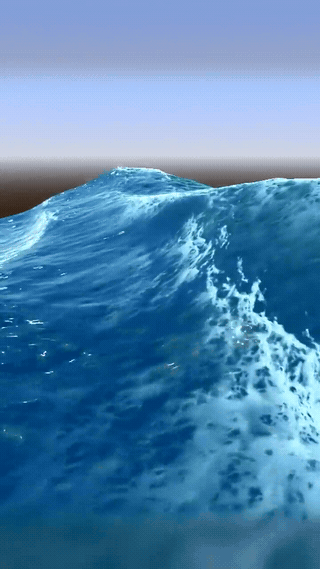
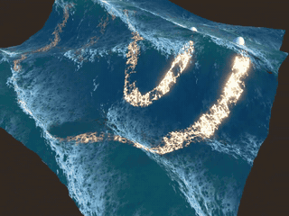

# Simple Godot Water Shader 🌊

A simple water shader project made in Godot 4.

## Getting Started

1. Clone the repository.
2. Open Godot, press **Import**, and select the folder you cloned the repository into.
3. Run the project.

## Features

- Gerstner waves
- Persisting Jacobian foam
- Persisting intersection foam
- Non persisting intersection "strip" foam
- Depth fading with adjustable light attenuation
- Refractions

  <video src="https://github.com/user-attachments/assets/effc825d-3c1c-45bc-8c1f-c25df8bc09bc"></video>
  
  

